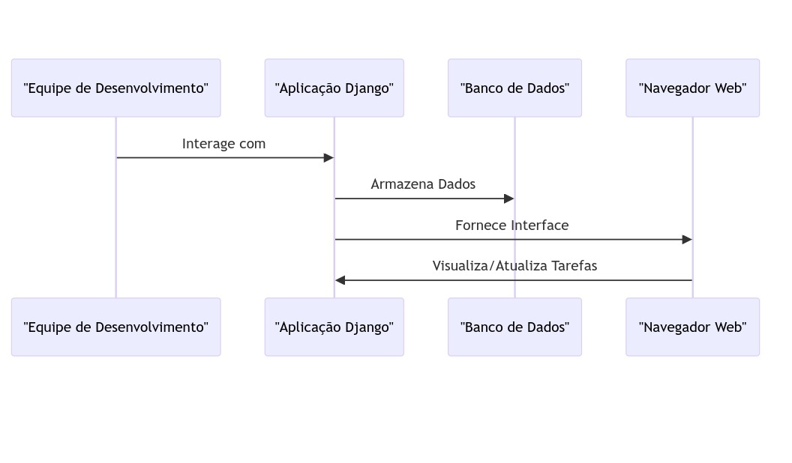

# Projeto final

Em grupos de **até seis pessoas**, escolham uma biblioteca ou framework para elaboração do projeto.

## 1. Requisitos
- Seu projeto deverá ser entregue no formato de link de repositório público do GitHub, a ser enviado para o email `ah.driano@gmail.com` com o título `Projeto Final - IFMT 2023` até o dia 11/11/2023. Este repositório deve conter o código da solução e um arquivo `README.md` conforme o exemplo em anexo.
- O trabalho também deverá ser apresentado no formato de seminário no dia 11/11/2023. Esta apresentação deverá ter entre 15 e 30 minutos.
- A biblioteca ou framework utilizados poderão ser relacionados à qualquer tecnologia, à escolha do grupo.

Referências úteis para escrita de documentos Markdown:
- [Markdown Guide](https://www.markdownguide.org/basic-syntax/)
- [GitHub Docs - Basic writing and formatting syntax](https://docs.github.com/en/get-started/writing-on-github/getting-started-with-writing-and-formatting-on-github/basic-writing-and-formatting-syntax)
- [Mermaid](https://mermaid.js.org/intro/)

---

# Projeto Final - Desenvolvimento de Software Através de Frameworks @ IFMT/2023

- **Biblioteca/Framework:** [Django](https://www.djangoproject.com/)
- **Tecnologias aplicadas:** Lista de linguagens utilizadas.
- **Integrantes:**
  - Antonio Flavio
  - Kelsey Santos
  - Robert de Carvalho
  - Jairo Gean
  - Ricardo Von Eicheendorff Espirito Santo

## 1. Descrição da biblioteca/framework

Django é um framework web de alto nível, escrito em Python, que incentiva o desenvolvimento rápido e limpo. Criado para facilitar a construção de aplicações web complexas, o Django segue o padrão de arquitetura de software conhecido como Model-View-Controller (MVC), embora ele próprio se refira a esse padrão como Model-View-Template (MVT).


A função principal do Django é proporcionar uma estrutura robusta e eficiente para o desenvolvimento de aplicações web, permitindo que os desenvolvedores foquem na lógica de negócios específica de suas aplicações, enquanto o framework cuida de tarefas comuns e desafios associados ao desenvolvimento web.

Ele resolve uma variedade de problemas comuns, oferecendo abstrações de banco de dados, segurança integrada, administração automática de conteúdo, escalabilidade e extensibilidade, manipulação de formulários, roteamento simples, templates para separação de lógica de apresentação e mais. Seu objetivo é fornecer uma estrutura sólida que acelere o desenvolvimento, seguindo padrões de projeto robustos e promovendo boas práticas de programação.

> Descreva a biblioteca ou framework escolhido. Sua função principal, quais tipos de problemas ela resolve

## 2. Descrição do problema

**Cenário:**

Uma equipe de desenvolvimento em uma empresa precisa de um sistema eficiente para gerenciar suas tarefas diárias, colaboração em projetos e acompanhamento do progresso. Eles enfrentam desafios na comunicação, organização e monitoramento do status das tarefas.

**Desafios:**

1. **Colaboração Eficiente:** A equipe necessita de uma plataforma centralizada para criar, atribuir e acompanhar tarefas, promovendo uma colaboração mais eficiente.
2. **Acompanhamento do Progresso:** É essencial ter uma visão clara do status das tarefas, entender quais estão em andamento, concluídas ou atrasadas.
3. **Comunicação Interna:** A equipe precisa de um meio integrado de comunicação para discutir tarefas, compartilhar atualizações e resolver problemas de forma rápida.
4. **Segurança de Dados:** Dada a natureza sensível das informações sobre projetos, é crucial garantir a segurança e integridade dos dados.

**Como Django Pode Resolver:**

1. **Desenvolvimento Rápido:** Django permite o desenvolvimento rápido da aplicação, oferecendo uma estrutura baseada em convenções que agiliza a criação de funcionalidades.
2. **Abstração de Banco de Dados:** O ORM do Django facilita a gestão e manipulação de dados relacionados a tarefas e projetos.
3. **Sistema de Usuário Integrado:** Django possui um sistema de usuário integrado, facilitando a autenticação e autorização de membros da equipe.
4. **Segurança Integrada:** Django incorpora práticas de segurança padrão, como proteção contra injeções de SQL e CSRF.

**Diagrama Simplificado:**
```
sequenceDiagram
  participant A as "Equipe de Desenvolvimento"
  participant B as "Aplicação Django"
  participant C as "Banco de Dados"
  participant D as "Navegador Web"

  A->>B: Interage com
  B->>C: Armazena Dados
  B->>D: Fornece Interface
  D->>B: Visualiza/Atualiza Tarefas
``````


Este é um diagrama básico que representa a interação entre a equipe de desenvolvimento, a aplicação Django e o banco de dados. Copie e cole este código no seu arquivo Markdown no GitHub para visualizar o diagrama.

*Elabore uma situação hipotética que pode ser resolvida com a aplicação desta biblioteca/framework. Fique à vontade para utilizar recursos como diagramas, fotos, vídeos, etc.*

## 3. Solução

Tem que haver alguns passos para a Solução do Problema:
1. **Configuração do Ambiente de Desenvolvimento:**
   - Instale o Django no ambiente de desenvolvimento utilizando o seguinte comando:
     ```bash
     pip install django
     ```
2. **Criação do Projeto Django:**
   - Utilize o seguinte comando para criar um novo projeto Django chamado "GerenciamentoTarefas":
     ```bash
     django-admin startproject GerenciamentoTarefas
     ```
3. **Definição do Modelo de Dados:**
   - No arquivo `models.py` do aplicativo, defina os modelos de dados para representar Tarefas e Projetos.
     ```python
     # models.py
     from django.db import models

     class Projeto(models.Model):
         nome = models.CharField(max_length=100)

     class Tarefa(models.Model):
         projeto = models.ForeignKey(Projeto, on_delete=models.CASCADE)
         descricao = models.TextField()
         concluida = models.BooleanField(default=False)
     ```
4. **Aplicação de Migrações:**
   - Execute as migrações para criar as tabelas no banco de dados.
     ```bash
     python manage.py makemigrations
     python manage.py migrate
     ```
5. **Criação das Views e Templates:**
   - Implemente views para exibir a lista de tarefas, detalhes da tarefa, etc.
   - Utilize templates HTML para renderizar as páginas.
   - Exemplo de uma view simples:
     ```python
     # views.py
     from django.shortcuts import render
     from .models import Tarefa

     def lista_tarefas(request):
         tarefas = Tarefa.objects.all()
         return render(request, 'lista_tarefas.html', {'tarefas': tarefas})
     ```
6. **Configuração das URLs:**
   - Configure as URLs no arquivo `urls.py` do aplicativo para mapear as views.
     ```python
     # urls.py
     from django.urls import path
     from .views import lista_tarefas

     urlpatterns = [
         path('tarefas/', lista_tarefas, name='lista_tarefas'),
         # Adicione mais padrões de URL conforme necessário
     ]
     ```
7. **Integração com o Sistema de Usuários do Django:**
   - Utilize o sistema de usuários do Django para gerenciar a autenticação e autorização dos membros da equipe.
   - Adicione a aplicação 'django.contrib.auth' às configurações.
8. **Implementação da Lógica de Negócios:**
   - Desenvolva a lógica necessária para criar, atribuir, e acompanhar tarefas.
   - Adicione funcionalidades como marcação de tarefas concluídas, filtragem por status, etc.
9. **Estilização e Front-End:**
   - Utilize HTML, CSS e possivelmente JavaScript para criar uma interface amigável e responsiva.
10. **Testes Unitários:**
   - Escreva testes unitários para garantir que a aplicação funcione conforme esperado.
     ```bash
     python manage.py test
     ```
11. **Implantação:**
   - Para a implantação, considere o uso de serviços como Heroku, AWS, ou outros de sua escolha.
   - Configure as variáveis de ambiente, ajuste as configurações do banco de dados, e realize as migrações no ambiente de produção.

> De forma objetiva, descreva os passos utilizados para a solução do problema elaborado. Se necessário, utilize partes de código, links, ou quaisquer outros recursos que julgarem necessários.

## 4. Referências

[DJANGO DOCS](https://docs.djangoproject.com/en/4.2/)

[DJANGO](https://www.djangoproject.com/)